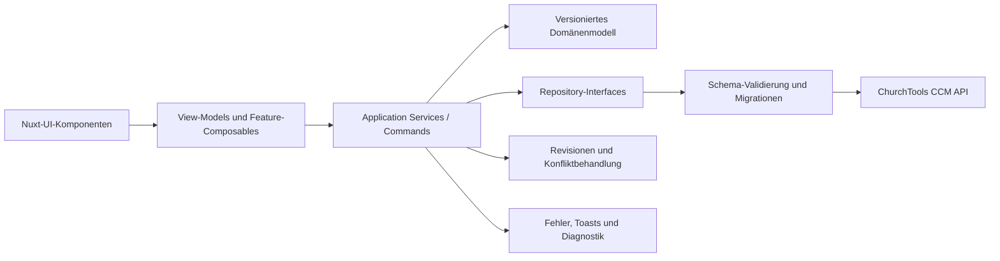

# Extension Tasks – Projekt-Audit und Entwicklungsplan

Stand: 03.10.2026

Untersuchter Commit: `e95424f`

## 1. Kurzfazit

Extension Tasks hat inzwischen einen tragfähigen Funktionskern und eine deutlich
stimmigere Oberfläche. Projekte, Listen, Aufgaben, Unteraufgaben, Tags,
Zuweisungen, Fälligkeiten, Kommentare, Suche und Drag-and-drop sind vorhanden.
Die Anwendung lässt sich bauen, die vorhandenen Tests laufen durch und im
lokalen ChurchTools-System treten auf der geprüften Board-Route keine
Konsolenfehler auf.

Für einen verlässlichen produktiven Einsatz fehlen vor allem Schutzmechanismen
auf der Datenebene. Aufgaben und Projekte werden als vollständige JSON-Objekte
in CCM-Werten gespeichert. Gleichzeitige Änderungen können sich deshalb
unbemerkt überschreiben. Außerdem werden gespeicherte Daten nicht gegen ein
Laufzeitschema geprüft und besitzen keine explizite Schemaversion. Beschädigte
oder ältere Daten können dadurch ganze Ansichten unbrauchbar machen.

Die nächsten Arbeiten sollten sich daher zuerst auf Datenintegrität,
Migrationen und robuste Schreibvorgänge konzentrieren. Danach folgen
Performance, Berechtigungen, Barrierefreiheit, CSS-Isolation und der
Store-/Release-Prozess. Produktfunktionen wie Prioritäten, gespeicherte
Ansichten, Erinnerungen oder Kalenderansichten bauen sinnvoll auf dieser Basis
auf.

## 2. Prioritäten

| Priorität | Bedeutung                                                                        | Reaktionsziel                              |
| --------- | -------------------------------------------------------------------------------- | ------------------------------------------ |
| **P0**    | Gefahr von Datenverlust oder ein grundlegender Stabilitätsfehler                 | Vor produktiver Freigabe beheben           |
| **P1**    | Hohe Auswirkung auf Zuverlässigkeit, Sicherheit, Betrieb oder zentrale Bedienung | Im nächsten Stabilisierungsschritt beheben |
| **P2**    | Klarer Qualitäts-, Wartungs- oder Funktionsgewinn                                | Danach geplant umsetzen                    |
| **P3**    | Ausbau und Differenzierung des Produkts                                          | Nach stabiler Kernplattform priorisieren   |

### Umsetzungsstand vom 03.10.2026

Die im Anschluss an den Audit beauftragten Performance- und UI/UX-Punkte wurden
in einem ersten Stabilisierungsschritt bearbeitet:

| Finding | Status                   | Umsetzung                                                                                                                                                                                                                                       |
| ------- | ------------------------ | ----------------------------------------------------------------------------------------------------------------------------------------------------------------------------------------------------------------------------------------------- |
| DATA-02 | **Weitgehend umgesetzt** | Persistierte Entitäten besitzen ein Laufzeitschema und werden von Version 0 auf Version 1 migriert. Defekte Einzelwerte werden isoliert und sichtbar gemeldet. Automatische Schreibmigrationen erfolgen erst beim nächsten regulären Speichern. |
| PERF-01 | **Umgesetzt**            | Projektübergreifende Aufgaben werden für die globale Suche erst beim Öffnen des Suchdialogs geladen.                                                                                                                                            |
| PERF-02 | **Umgesetzt**            | Aufgabenkarten verwenden einen gemeinsamen Projektkontext mit Task-, Eltern-, Tag- und Personen-Lookups. Personen werden pro Projekt gebündelt geladen.                                                                                         |
| PERF-03 | **Umgesetzt**            | Die Personensuche wartet 250 ms, ignoriert überholte Antworten und zeigt Lade- sowie Fehlerzustände.                                                                                                                                            |
| UX-01   | **Umgesetzt**            | Einklappen sowie die Anzeige erledigter Aufgaben und Unteraufgaben werden lokal pro Projekt und Liste gespeichert.                                                                                                                              |
| UX-02   | **Umgesetzt**            | Suchtexte werden pro Projekt getrennt gehalten.                                                                                                                                                                                                 |
| UI-02   | **Umgesetzt**            | Listenansichten besitzen eine kompakte Zeilendarstellung.                                                                                                                                                                                       |
| UX-03   | **Weitgehend umgesetzt** | Schreibfehler bleiben am betroffenen Bereich sichtbar; alle destruktiven Projekt-, Listen-, Tag- und Aufgabenaktionen verlangen eine Bestätigung.                                                                                               |
| UX-04   | **Umgesetzt**            | Der Aufgabeneditor bietet eine direkte Listenauswahl und wählt beim Erstellen die Standardliste vor.                                                                                                                                            |
| A11Y-01 | **Teilweise umgesetzt**  | Aufgabenkarten, Statusschalter und zentrale Icon-Aktionen sind benannt und per Tastatur erreichbar. Ein vollständiger Axe- und Screenreader-Test bleibt offen.                                                                                  |
| UI-01   | **Teilweise umgesetzt**  | Globale Reset-Regeln und Tailwind Preflight wurden entfernt bzw. auf den Extension-Root begrenzt. Die generierten unpräfixierten Utility-Klassen bleiben als Integrationsrisiko offen.                                                          |

Beim Browser-Smoke-Test wurde außerdem ein älterer CCM-Wert mit einem ungültigen
`tags`-Feld gefunden. Array-Felder werden in Karten, Lookups und Editor-Drafts
nun defensiv normalisiert. Das ersetzt nicht die unter DATA-02 geforderte
vollständige Schemavalidierung und Migration.

## 3. Verifizierter technischer Stand

### 3.1 Erfolgreich geprüft

- TypeScript-Prüfung erfolgreich
- ESLint-Prüfung erfolgreich
- 6 Testdateien mit 26 Tests erfolgreich
- Produktions-Build erfolgreich
- Lokale Board-Route `http://churchtools.test/ccm/tasks/3/board` ohne
  Konsolenwarnungen oder Konsolenfehler geladen
- `crypto.randomUUID` besitzt einen getesteten Fallback
- Fehlgeschlagene Drag-and-drop-Schreibvorgänge werden zurückgerollt
- Vue Query invalidiert betroffene CCM-Abfragen nach Mutationen

### 3.2 Build- und Bundle-Befunde

- Das größte JavaScript-Bundle umfasst ungefähr 1,30 MB minifiziert bzw.
  391 KB gzip-komprimiert.
- Vite meldet ein Chunk-Limit von mehr als 500 KB.
- Das CSS umfasst ungefähr 111 KB minifiziert bzw. 16 KB gzip-komprimiert.
- Die Routen werden derzeit nicht sichtbar in eigene, lazy geladene Chunks
  aufgeteilt.

### 3.3 Dependency- und Security-Stand

`npm audit` meldet fünf bekannte Schwachstellen:

- vier hohe Findings in der Entwicklungswerkzeug-Kette
  `@vue/eslint-config-typescript → fast-glob → micromatch → braces`
- ein niedriges Finding in einer verschachtelten `esbuild`-Version über
  `@nuxt/ui → @nuxt/fonts → fontless`

Mit `--omit=dev` bleibt nur das niedrige `esbuild`-Finding übrig. Es betrifft
den Entwicklungsserver unter Windows. Der direkte Vite-Zweig verwendet bereits
eine neuere `esbuild`-Version.

`npm outdated --json` lieferte in zwei Versuchen kein Ergebnis und musste
abgebrochen werden. Eine belastbare Liste aller verfügbaren Updates ist deshalb
noch offen. Das von `npm audit` vorgeschlagene automatische Downgrade der
ESLint-Konfiguration sollte nicht ungeprüft übernommen werden.

### 3.4 Test- und CI-Umfang

Die CI führt unter Node 24 `npm ci` und `npm run check` aus. Die Engine erlaubt
Node 22 und 24, die CI prüft jedoch nur Node 24. Browser-End-to-End-Tests,
Coverage-Grenzen, Store-Paket-Prüfungen, Upgrade-Tests und eine automatisierte
Dependency-Pflege fehlen.

## 4. Vorhandener Funktionsumfang

| Bereich       | Vorhanden                                                     | Reifegrad / Einschränkung                                   |
| ------------- | ------------------------------------------------------------- | ----------------------------------------------------------- |
| Projekte      | Erstellen, bearbeiten, löschen, Farbe, Icon, Beschreibung     | Gute Basis; Löschen und Fehlerfälle brauchen mehr Schutz    |
| Aufgaben      | Titel, Beschreibung, URL, Datum, Abschluss                    | Kern funktionsfähig; keine Priorität und keine Archivierung |
| Listen        | Mehrere Listen, Sortierung per Drag-and-drop, Ein-/Ausklappen | Anzeigeoptionen werden teamweit gespeichert                 |
| Ansichten     | Board, Liste, „Meine Aufgaben“, Tags, Unteraufgaben           | Listenansicht nutzt weiterhin weitgehend Karten             |
| Unteraufgaben | Verschachtelung, Fortschritt, Duplizieren, rekursives Löschen | Mehrere Schreibschritte sind nicht atomar                   |
| Tags          | CRUD und Mehrfachauswahl                                      | Löschen über mehrere Aufgaben kann teilweise scheitern      |
| Personen      | Zuweisung und Personensuche                                   | Fehler- und Reihenfolgebehandlung der Suche fehlen          |
| Fälligkeit    | Absolutes und relatives Fälligkeitsdatum                      | Relative Eingabe nur in bestimmten Bearbeitungswegen        |
| Aktivität     | Kommentare und Änderungsprotokoll                             | Keine robuste Fehleranzeige; gemischte Sprache              |
| Suche         | Projektbezogene und globale Suche                             | Globale Suche erzeugt viele Requests                        |
| Oberfläche    | Nuxt-UI-Dashboard, Navigation, Sidebar, Dialoge               | Gute Richtung; A11y, Fokus und Konsistenz noch offen        |
| Auslieferung  | Build, ZIP-Skript, CI                                         | CCM-Store-Kompatibilität und Upgrade-Pfad nicht verifiziert |

## 5. Priorisierte Übersicht

| ID       | Prio   | Typ                | Finding                                                                             |
| -------- | ------ | ------------------ | ----------------------------------------------------------------------------------- |
| DATA-01  | **P0** | Datenintegrität    | Gleichzeitige Vollobjekt-Schreibvorgänge können Änderungen verlieren                |
| DATA-02  | **P0** | Datenmodell        | Keine Laufzeitvalidierung, Schemaversion oder Migration gespeicherter Daten         |
| DATA-03  | **P1** | Datenintegrität    | Mehrstufige Operationen sind nicht atomar und nicht wiederaufnehmbar                |
| DATA-04  | **P1** | Datenintegrität    | Rekursives Löschen kann Teilzustände und verwaiste Referenzen hinterlassen          |
| SEC-01   | **P1** | Sicherheit         | Gespeicherte Aufgaben-URLs werden nicht ausreichend normalisiert und eingeschränkt  |
| PERF-01  | **P1** | Performance        | Die globale Suche lädt Aufgaben aller Projekte auf jeder Route                      |
| PERF-02  | **P1** | Architektur        | Jede Aufgabenkarte erzeugt einen umfangreichen Composable-/Observer-Baum            |
| UX-01    | **P1** | Produktlogik       | Persönliche Anzeigeoptionen werden als gemeinsame Projektdaten gespeichert          |
| UI-01    | **P1** | Integration        | Globale CSS-Regeln können das umgebende ChurchTools-Frontend beeinflussen           |
| ARCH-01  | **P1** | Abhängigkeiten     | Font Awesome hängt im Produktionsbetrieb weiterhin implizit vom Host ab             |
| AUTH-01  | **P1** | Berechtigungen     | Fehlgeschlagene Benutzerauflösung wird verschluckt und führt zu Nutzer-ID 0         |
| A11Y-01  | **P1** | Barrierefreiheit   | Karten, Checkboxen und Icon-Aktionen sind teilweise nicht per Tastatur bedienbar    |
| STORE-01 | **P1** | Distribution       | CCM-Store-Paket, Metadaten und Update-/Migrationspfad sind nicht verifiziert        |
| TEST-01  | **P1** | Qualität           | Kritische Daten-, Dialog-, Berechtigungs- und Integrationspfade sind ungetestet     |
| DEP-01   | **P1** | Dependencies       | Bekannte Audit-Findings und fehlende Update-Automatisierung                         |
| UX-02    | **P2** | Suche              | Suchzustand bleibt projektübergreifend erhalten und kann leere Boards erzeugen      |
| UI-02    | **P2** | Informationsdichte | Listenansichten sind keine echte kompakte Listen- oder Tabellenansicht              |
| UX-03    | **P2** | Feedback           | Bestätigungen und Fehlerdarstellung sind uneinheitlich                              |
| PERF-03  | **P2** | Netzwerk           | Personensuche hat kein Debouncing, Abbrechen oder Schutz vor alten Antworten        |
| DATA-05  | **P2** | Aktivität          | Kommentare werden optimistisch geleert, obwohl Speichern scheitern kann             |
| UX-04    | **P2** | Aufgabenanlage     | Direkte Listenauswahl und ein konsistenter Quick-add-Ablauf fehlen                  |
| ARCH-02  | **P2** | Codequalität       | Tote Zustände, unscharfe Typen und historische Feldnamen belasten das Modell        |
| I18N-01  | **P2** | Lokalisierung      | Übersetzungsfunktion ist ein Platzhalter; Texte und Farbwerte sind gemischtsprachig |
| OPS-01   | **P2** | Betrieb            | Keine sichtbare Version, Diagnoseansicht oder korrelierbare Fehlerkennung           |
| FEAT-01  | **P2** | Feature            | Prioritäten, Filter, Sortierung, gespeicherte Ansichten und Mehrfachaktionen fehlen |
| FEAT-02  | **P3** | Feature            | Wiederholungen, Erinnerungen, Vorlagen, Papierkorb und Abhängigkeiten fehlen        |
| FEAT-03  | **P3** | Feature            | Anhänge, Erwähnungen, Abos und ChurchTools-Objektbezüge fehlen                      |
| FEAT-04  | **P3** | Feature            | Kalender, Timeline, Kapazität und Auswertungen fehlen                               |

## 6. Findings nach Typ

### 6.1 Datenintegrität und Datenmodell

#### DATA-01 · P0 · Verlorene Änderungen bei paralleler Bearbeitung

**Beobachtung:** Aufgaben, Listen, Tags und Projekte werden als vollständige
JSON-Objekte gelesen, lokal verändert und anschließend komplett in einen
CCM-Wert zurückgeschrieben. Es gibt keine Revision, keinen ETag und keinen
Compare-and-swap-Mechanismus.

**Auswirkung:** Bearbeiten zwei Personen dieselbe Aufgabe kurz nacheinander,
kann der spätere Schreibvorgang Felder des ersten Schreibvorgangs mit seinem
älteren Stand überschreiben. Die Oberfläche meldet dabei Erfolg.

**Empfehlung:**

1. Jedes gespeicherte Objekt erhält `revision` und `updatedAt`.
2. Updates senden die erwartete Revision mit.
3. Der Server oder ein vorgeschalteter Repository-Layer weist veraltete
   Revisionen zurück.
4. Die UI zeigt einen Konfliktdialog mit Neuladen, Zusammenführen und erneutem
   Speichern.
5. Bis echte atomare Serveroperationen verfügbar sind, sollte die Anwendung
   vor jedem Schreibvorgang den aktuellen Stand nachladen und Konflikte
   erkennen.

**Akzeptanz:** Ein automatisierter Test mit zwei Clients kann keine Änderung
unbemerkt verlieren.

#### DATA-02 · P0 · Fehlende Laufzeitvalidierung und Migrationen

**Status:** Weitgehend umgesetzt. Version 1, die Migration von unversionierten
Werten und die Isolation defekter Einträge sind implementiert. Ein administrativer
Migrationslauf für das sofortige Zurückschreiben aller Altwerte bleibt offen.

**Umsetzung:** Projekte, Aufgaben, Listen und Tags werden beim Lesen durch ein
zentrales Laufzeitschema geführt. Unversionierte Daten gelten als Version 0 und
werden über eine reine Migration nach Version 1 überführt. Optionale beschädigte
Felder werden normalisiert. Unbrauchbare Entitäten werden isoliert und mit ihrer
CCM-ID in der Oberfläche gemeldet, ohne die übrige Abfrage zu blockieren. Neue
und regulär bearbeitete Werte werden mit `schemaVersion: 1` gespeichert.

**Offen:** Die Migration arbeitet bewusst lazy und schreibt Altwerte nicht allein
durch das Lesen zurück. Ein administrativer Migrationslauf mit Vorschau wäre für
große Installationen sinnvoll. Jede zukünftige Schemaänderung benötigt eine
weitere explizite Migration und passende Bestandsdatentests.

**Akzeptanz:** Für Version 1 erfüllt. Beschädigte Testwerte blockieren keine
Projektabfrage; unterstützte Altstände werden automatisch migriert und
zukünftige unbekannte Versionen kontrolliert abgewiesen.

#### DATA-03 · P1 · Nicht atomare Mehrfachoperationen

**Beobachtung:** Mehrere Anwendungsfälle bestehen aus getrennten Requests:

- Projekt erstellen, anschließend Standardliste erstellen
- Unteraufgabe erstellen, anschließend die Elternaufgabe verknüpfen
- Tag aus allen Aufgaben entfernen, anschließend den Tag löschen
- Aufgabe duplizieren, anschließend Nachfahren und Referenzen erzeugen

**Auswirkung:** Netzfehler oder fehlende Berechtigungen zwischen den Schritten
hinterlassen unvollständige Projekte, verwaiste Aufgaben oder inkonsistente
Referenzen. Ein manueller Retry kann Duplikate erzeugen.

**Empfehlung:** Kommandos in einem Application-Service bündeln, idempotente
Operation-IDs verwenden und Kompensationsschritte definieren. Die UI sollte
erst Erfolg melden, wenn der vollständige Ablauf abgeschlossen ist.

#### DATA-04 · P1 · Rekursives Löschen ohne Wiederherstellung

**Beobachtung:** Aufgabe und Unteraufgaben werden nacheinander gelöscht.
Referenzen werden ebenfalls in separaten Schritten angepasst.

**Auswirkung:** Teilfehler führen zu verwaisten Beziehungen. Versehentliches
Löschen ist endgültig.

**Empfehlung:** Zunächst Soft Delete mit Papierkorb einführen. Ein Hintergrund-
oder Wartungslauf kann endgültig löschen und Referenzen reparieren. Der
Löschbefehl muss wiederholbar und transaktional modelliert sein.

#### DATA-05 · P2 · Unsicherer Kommentarablauf

**Beobachtung:** Das Kommentarfeld wird nach dem Emit geleert. Der aufrufende
Dialog wartet den Schreibvorgang nicht konsistent ab. Leerraum-Kommentare
können gespeichert werden und jeder Kommentar schreibt das vollständige
Aufgabenobjekt.

**Empfehlung:** Text trimmen, leere Kommentare blockieren, Speichern abwarten,
Fehler am Eingabefeld zeigen und erst nach Erfolg leeren. Kommentare sollten
langfristig eigene Entitäten oder Append-only-Ereignisse sein.

### 6.2 Sicherheit und Berechtigungen

#### SEC-01 · P1 · URL-Validierung

**Beobachtung:** Aufgaben-URLs werden über ein `type="url"`-Feld erfasst, aber
nicht als Teil eines verlässlich validierten Formularschemas normalisiert. Der
gespeicherte Wert wird als Linkziel verwendet.

**Auswirkung:** Ungeeignete Protokolle und uneinheitliche URLs können in
Bestandsdaten gelangen. Externe Links brauchen außerdem eine sichere
Fensterbehandlung.

**Empfehlung:** Beim Speichern mit `new URL()` parsen, ausschließlich `http:`
und `https:` erlauben, normalisiert speichern und externe Links mit
`rel="noopener noreferrer"` öffnen.

#### AUTH-01 · P1 · Unklare Benutzer- und Rechtefehler

**Beobachtung:** Schlägt das Laden des aktuellen Benutzers fehl, wird der Fehler
verschluckt und der Benutzer bleibt bei ID `0`. Dadurch erscheinen „Meine
Aufgaben“ und Zuweisungsoptionen leer oder unvollständig. Aktivitäten können
mit einer unbekannten Person erzeugt werden.

**Empfehlung:** Authentifizierungsfehler als eigenen App-Zustand behandeln,
Schreibaktionen sperren und eine verständliche Wiederholen-Aktion anbieten.
Die tatsächliche Wirkung von `securityLevelId: 1` auf Lesen, Schreiben und
Löschen muss gegen ChurchTools verifiziert und dokumentiert werden.

### 6.3 Architektur und Performance

#### PERF-01 · P1 · Globale Suche lädt alle Aufgaben

**Beobachtung:** Die App initialisiert die projektübergreifende Aufgabensuche
bereits im Wurzel-Layout. Dafür wird pro Projekt eine Values-Abfrage ausgeführt,
auch wenn die Suche nicht geöffnet ist.

**Auswirkung:** Die Request-Zahl wächst linear mit der Projektanzahl. Große
Installationen zahlen diese Kosten auf jeder Route.

**Empfehlung:** Daten erst beim Öffnen der globalen Suche laden, Eingabe
debouncen, Ergebnisse paginieren und mittelfristig einen serverseitigen
Suchindex oder eine gezielte Such-API verwenden.

#### PERF-02 · P1 · Composable-Baum pro Aufgabenkarte

**Beobachtung:** Jede Aufgabenkarte initialisiert eigene Task-, Listen-, Tag-
und Personen-Composables. Vue Query teilt zwar HTTP-Caches, trotzdem entstehen
pro Karte Observer und abgeleitete Zustände. Eltern werden durch Scans über die
Aufgabenmenge ermittelt.

**Auswirkung:** Große Boards verursachen unnötige Reaktivitätsarbeit und einen
hohen Speicherbedarf.

**Empfehlung:** Normalisierte Daten und Lookup-Maps auf Ansichts- oder
Projektebene bereitstellen. Karten erhalten fertige View-Models. Für sehr große
Listen Virtualisierung ergänzen.

#### PERF-03 · P2 · Personensuche ohne Request-Kontrolle

**Beobachtung:** Die Suche besitzt kein Debouncing, kein Abort-Signal und keine
Absicherung gegen verspätete Antworten.

**Auswirkung:** Schnelles Tippen erzeugt viele Requests; ein älteres Ergebnis
kann ein neueres überschreiben.

**Empfehlung:** 200–300 ms debouncen, laufende Requests abbrechen, Query-Key
über den Suchtext führen und Lade-, Leer- und Fehlerzustände unterscheiden.

#### ARCH-01 · P1 · Implizite Font-Awesome-Abhängigkeit

**Beobachtung:** Font-Awesome-CSS wird nur in der Entwicklung importiert. Der
Produktions-Build verwendet weiterhin Font-Awesome-Klassennamen und verlässt
sich damit auf das ChurchTools-Hostsystem. Lokale Font-Awesome-Dateien unter
`src/assets/fontawesome` sind vorhanden, werden aber nicht genutzt.

**Auswirkung:** Die Extension ist nicht vollständig eigenständig. Änderungen
am Host können Icons verschwinden lassen oder verändern.

**Empfehlung:** Icons vollständig über Nuxt UI/Iconify oder explizit gebündelte
SVG-Komponenten abbilden. Danach ungenutzte Assets und die bedingte
Host-Abhängigkeit entfernen.

#### ARCH-02 · P2 · Typ- und Zustandsbereinigung

**Beobachtung:** Domänentypen liegen global im Ambient Scope, `ActivityEntry`
enthält `any`, Board-Komponenten benötigen Casts und das persistierte Feld
`fullfilled` ist falsch geschrieben. Daneben existieren nicht oder nur teilweise
genutzte Zustände wie `showSubTasks`, `sortBy`, `allDay` und historische
`comments`.

**Empfehlung:** Explizite Modul-Exports, diskriminierte Unions und ein
versioniertes Domänenmodell einführen. Historische Felder über Migrationen
bereinigen und ungenutzten Zustand entfernen oder vollständig implementieren.

### 6.4 UI, UX und Barrierefreiheit

#### UX-01 · P1 · Persönliche Einstellungen sind Teamdaten

**Beobachtung:** `isCollapsed`, `showCompleted` und `showSubTasks` werden in der
gemeinsamen Liste gespeichert. Diese Einstellungen wirken in der Bedienung wie
persönliche Ansichtspräferenzen.

**Auswirkung:** Eine Person ändert unbeabsichtigt die Ansicht aller anderen und
erzeugt zusätzliche Schreibvorgänge.

**Empfehlung:** Inhaltliche Listendaten von Benutzerpräferenzen trennen.
Einklappzustand und Filter gehören in lokalen oder benutzerspezifischen
Storage; gemeinsame Defaults können separat im Projekt liegen.

#### UI-01 · P1 · CSS-Isolation gegenüber ChurchTools

**Beobachtung:** Tailwind wird sowohl mit als auch ohne Prefix eingebunden.
Globale Selektoren für `*`, `body`, Links, Buttons und Eingaben können außerhalb
des Extension-Roots wirken. Layoutberechnungen verlassen sich zudem auf eine
feste Headerhöhe von 49 Pixeln.

**Auswirkung:** Die Extension kann das Host-Frontend verändern und umgekehrt
durch Host-Styles beschädigt werden.

**Empfehlung:** Alle Styles unter einem eindeutigen Extension-Root scopen,
Preflight entweder deaktivieren oder vollständig scopen und nur eine
Tailwind-Strategie behalten. Verfügbare Höhe aus dem Container statt aus einer
festen Host-Annahme ableiten.

#### A11Y-01 · P1 · Fehlende semantische Interaktion

**Beobachtung:** Aufgabenkarten sind klickbare `div`-Elemente, Checkboxen teils
klickbare Icons. Mehrere Icon-Buttons besitzen keinen zugänglichen Namen.

**Auswirkung:** Tastatur- und Screenreader-Nutzung ist lückenhaft. Fokusführung
und erwartete Button-Semantik fehlen.

**Empfehlung:** Interaktive Elemente als `button`, `a` oder Checkbox rendern,
zugängliche Namen vergeben, sichtbare Fokuszustände prüfen und Dialogfokus nach
Öffnen und Schließen testen. Axe-Checks und Tastatur-Szenarien in die UI-Tests
aufnehmen.

#### UX-02 · P2 · Globaler Suchzustand

**Beobachtung:** Der Suchtext im Store bleibt beim Projektwechsel erhalten.

**Auswirkung:** Ein neu geöffnetes Projekt kann scheinbar leer sein, weil noch
ein alter Filter aktiv ist.

**Empfehlung:** Suche beim Projektwechsel leeren oder pro Projekt speichern und
einen klar sichtbaren aktiven Filter mit Zurücksetzen-Aktion anzeigen.

#### UI-02 · P2 · Fehlende kompakte Listenansicht

**Beobachtung:** Board, „Meine Aufgaben“ und Listenansicht verwenden weitgehend
dieselbe Kartenrepräsentation.

**Auswirkung:** Für viele Aufgaben fehlen Informationsdichte, Spaltenvergleich
und schnelles Scannen.

**Empfehlung:** Eine echte kompakte Liste oder Tabelle mit konfigurierbaren
Spalten, Sortierung und Inline-Aktionen ergänzen. Karten bleiben für das Board.

#### UX-03 · P2 · Uneinheitliches Feedback

**Beobachtung:** Projekte verwenden Toasts, andere Abläufe Inline-Fehler oder
verschlucken Fehler. Für Bestätigungen existieren native Dialoge neben
Nuxt-UI-Dialogen. Einige Löschaktionen haben keine Bestätigung.

**Empfehlung:** Einen zentralen Mutation- und Feedback-Layer definieren:
einheitliche Fehlermeldungen, Wiederholen-Aktion, fachliche Bestätigung und
optimistische Updates nur mit sauberem Rollback.

#### UX-04 · P2 · Aufgabenanlage und Listenzuordnung

**Beobachtung:** Der Editor bietet keine klare direkte Listenauswahl. Je nach
Einstieg wird implizit eine Liste verwendet.

**Empfehlung:** Ein konsistentes Quick-add mit sichtbarem Ziel sowie eine
Listenauswahl im vollständigen Editor ergänzen. Tastaturkürzel können die
Erfassung weiter beschleunigen.

### 6.5 Tests, Betrieb und Distribution

#### TEST-01 · P1 · Kritische Pfade ohne Testabdeckung

**Gut abgedeckt:** Kernoperationen der Aufgabenlogik, CCM-Invalidierung,
UUID-Fallback, Rückabwicklung eines fehlerhaften Drag-and-drop-Schreibens sowie
Schemavalidierung, Migration und Isolation beschädigter Einträge.

**Fehlend:**

- konkurrierende Änderungen und Konfliktbehandlung
- partielle Fehler mehrstufiger Kommandos
- Dialoge und Formularvalidierung
- Rechte-, Login- und Nutzerfehler
- Router- und Deep-Link-Verhalten
- globale Suche und Request-Fan-out
- Tastaturbedienung und zugängliche Namen
- CCM-Store-Installation und Upgrade

**Empfehlung:** Tests entlang der Risiken ergänzen. Wenige Browser-Szenarien
sollten Erstellen, Bearbeiten, Verschieben, Konflikt, Löschen/Wiederherstellen
und erneutes Laden abdecken.

#### STORE-01 · P1 · CCM-Store-Prozess nicht verifiziert

**Beobachtung:** Das Paket-Skript erstellt im Wesentlichen ein ZIP aus `dist`.
Ein überprüfter Manifest-, Signatur-, Mindestversions- und Upgrade-Prozess ist
im Projekt nicht dokumentiert oder getestet.

**Auswirkung:** Ein lokaler Build kann funktionieren, während Installation,
Routing, Assets oder Updates im CCM Store scheitern.

**Empfehlung:** Die aktuelle CCM-Store-Spezifikation gegen das Paket prüfen und
eine Testmatrix für Neuinstallation, Update mit Bestandsdaten, Assets unter
Unterpfaden, Cache-Busting und Deinstallation anlegen. Das erzeugte ZIP sollte
in CI strukturell validiert und als Release-Artefakt bereitgestellt werden.

#### DEP-01 · P1 · Dependency-Pflege

**Beobachtung:** Es bestehen Audit-Findings und kein automatisierter
Update-Prozess. Ein vollständiger Outdated-Report war während dieses Audits
nicht abrufbar.

**Empfehlung:**

1. Renovate oder Dependabot mit gruppierten, kleinen Updates einführen.
2. Direkte und transitive Audit-Pfade einzeln prüfen.
3. Nuxt UI, Vue, Vite, Vitest und TypeScript in getrennten PRs aktualisieren.
4. Nach jedem UI-Framework-Update visuelle Smoke-Tests ausführen.
5. Node 22 und 24 in CI prüfen.
6. Security-Ausnahmen nur mit Begründung und Ablaufdatum dokumentieren.

#### OPS-01 · P2 · Fehlende Diagnosefähigkeit

**Beobachtung:** Die Anwendung zeigt keine Build-Version und bietet keine
Diagnoseansicht für fehlerhafte CCM-Werte, Migrationsstand oder fehlgeschlagene
Requests.

**Empfehlung:** Version und Commit im Hilfebereich anzeigen, Fehler mit einer
korrelierbaren ID versehen und eine exportierbare Diagnose mit Versions-,
Schema- und Entitätsinformationen anbieten. Personenbezogene Inhalte dürfen
dabei nicht ungefragt exportiert werden.

### 6.6 Lokalisierung

#### I18N-01 · P2 · Unvollständige Übersetzungsstrategie

**Beobachtung:** `txx` gibt Texte unverändert zurück. Aktivitätstexte enthalten
englische Zustände wie `checked` und `unchecked`; Farbnamen werden als englische
Schlüssel dargestellt.

**Empfehlung:** Entweder echte i18n-Schlüssel mit deutscher und englischer
Übersetzung einführen oder die Anwendung bewusst deutsch halten und alle
technischen Werte vor der Anzeige übersetzen. Datums- und relative Zeitformate
müssen die aktive Locale verwenden.

## 7. Fehlende Produktfunktionen

### P2 · Nächster sinnvoller Produktumfang

- Priorität mit klarer visueller, filterbarer Darstellung
- kombinierbare Filter für Status, Person, Tag, Fälligkeit und Liste
- Sortierung nach Fälligkeit, Priorität, Erstellungs- und Änderungsdatum
- persönliche, gespeicherte Ansichten
- Mehrfachauswahl und Bulk-Aktionen
- schnelle Aufgabenerfassung mit Tastatur
- Archiv für abgeschlossene Aufgaben
- echte kompakte Tabellen-/Listenansicht
- bessere Überfällig-, Heute- und Demnächst-Ansichten

### P3 · Ausbau nach Stabilisierung

- Wiederholende Aufgaben und Erinnerungen
- Aufgabenvorlagen und Projektvorlagen
- Papierkorb mit Wiederherstellung
- Abhängigkeiten und Blocker zwischen Aufgaben
- Startdatum und optionaler Zeitraum
- Anhänge und ChurchTools-Dateibezüge
- Erwähnungen, Abonnements und Benachrichtigungen
- Bezüge zu ChurchTools-Personen, Gruppen, Kalenderterminen oder Songs
- feinere Projektrollen und Sichtbarkeiten
- Kalender- und Timeline-Ansicht
- Kapazitäts-, Durchsatz- und Fälligkeitsauswertungen
- Export und Import in dokumentierten Formaten

## 8. Empfohlene Zielarchitektur



Die Trennung verfolgt vier konkrete Ziele:

1. Komponenten kennen keine CCM-Payload-Struktur.
2. Jeder fachliche Anwendungsfall liegt in einem testbaren Kommando.
3. Jede gelesene Entität wird validiert und bei Bedarf migriert.
4. Schreibvorgänge erkennen Konflikte und liefern ein einheitliches Ergebnis.

Empfohlene Modulstruktur:

```text
src/
  domain/          Typen, Regeln, Schemaversionen
  application/     Commands, Queries, Kompensation
  infrastructure/  CCM-Client, Repository, Codecs
  features/        Projekt-, Aufgaben-, Tag- und Suchfunktionen
  ui/              Wiederverwendbare Nuxt-UI-Komponenten
  pages/           Route-Komposition
```

Eine vollständige Umsortierung ist nicht als einmaliger Umbau nötig. Neue
Stabilitätsarbeit sollte in dieser Richtung entstehen; bestehende Funktionen
können schrittweise migriert werden.

## 9. Empfohlene Umsetzung

### Phase 1 · Datenbasis absichern

1. Laufzeitschemas und `schemaVersion` ergänzen.
2. Migrationen und Quarantäne für ungültige Werte bauen.
3. Revisionen und Konflikterkennung einführen.
4. Mehrstufige Kommandos idempotent und fehlertolerant machen.
5. Soft Delete und Reparatur von Referenzen ergänzen.

**Ergebnis:** Bestandsdaten lassen sich sicher laden; parallele Arbeit verliert
keine Änderungen unbemerkt.

### Phase 2 · Integration und Betrieb härten

1. Authentifizierung und Berechtigungen explizit behandeln.
2. CSS vollständig auf den Extension-Root begrenzen.
3. Font-Awesome-Hostabhängigkeit entfernen.
4. CCM-Store-Paket und Upgrade-Pfad verifizieren.
5. Dependencies aktualisieren und Update-Automatisierung einführen.
6. Diagnoseinformationen und Versionsanzeige ergänzen.

**Ergebnis:** Die Extension funktioniert reproduzierbar in ChurchTools und im
CCM Store, ohne versteckte Abhängigkeiten zum Host-Frontend.

### Phase 3 · Performance, A11y und UX

1. Globale Suche nur bei Bedarf laden.
2. Daten auf Projektebene normalisieren und Karten vereinfachen.
3. Tastatur- und Screenreader-Bedienung schließen.
4. Feedback, Bestätigungen und Fehlermeldungen vereinheitlichen.
5. Persönliche Ansichtseinstellungen von Teamdaten trennen.
6. Echte kompakte Listenansicht bauen.

**Ergebnis:** Große Projekte bleiben schnell und alle zentralen Abläufe sind
verlässlich bedienbar.

### Phase 4 · Produkt auf die nächste Stufe bringen

1. Prioritäten, Filter, Sortierung und gespeicherte Ansichten
2. Bulk-Aktionen, Quick-add und Archiv
3. Wiederholungen, Erinnerungen und Vorlagen
4. Benachrichtigungen und ChurchTools-Bezüge
5. Kalender, Timeline und Auswertungen

## 10. Definition of Done für die nächste stabile Version

- Persistierte Daten besitzen ein validiertes, versioniertes Schema.
- Zwei parallele Bearbeitungen können sich nicht unbemerkt überschreiben.
- Mehrstufige Operationen sind wiederholbar oder werden sauber kompensiert.
- Fehlerhafte Einzelwerte blockieren keine vollständige Ansicht.
- Login- und Rechtefehler sind sichtbar und verhindern ungültige Schreibvorgänge.
- Globale Suche lädt erst bei Verwendung und skaliert nicht ungebremst mit allen
  Projekten.
- Zentrale Bedienwege funktionieren per Tastatur und besitzen zugängliche Namen.
- Styles wirken nur innerhalb des Extension-Roots.
- Der Produktions-Build hängt für Icons nicht vom Host-CSS ab.
- Neuinstallation und Update des CCM-Store-Pakets sind mit Bestandsdaten getestet.
- CI prüft Node 22 und 24 sowie Build, Tests, Lint, Typen und Paketstruktur.
- Bekannte Dependency-Findings sind behoben oder mit Ablaufdatum dokumentiert.

## 11. Einordnung bestehender Dokumente

[`UMSETZUNGSSTAND.md`](./UMSETZUNGSSTAND.md) beschreibt die historische
Entwicklung und bleibt als Verlauf nützlich. Diese Datei ist die aktuelle
technische und produktbezogene Bewertung. Ältere Dependency-Snapshots sind
nicht als Aussage über den heutigen Update-Stand zu verwenden.
