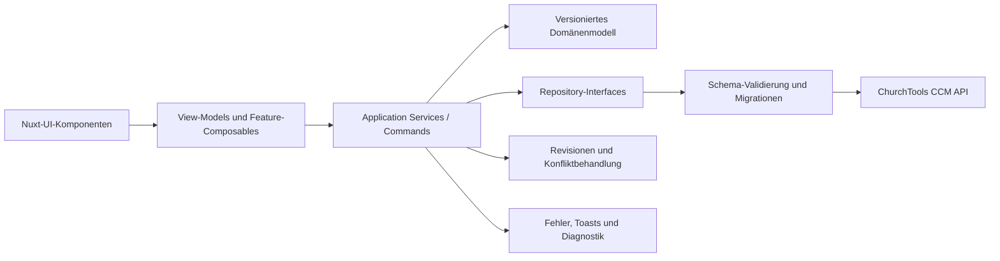

# Extension Tasks – Projekt-Audit und Entwicklungsplan

Stand: 04.10.2026

Arbeitsstand: Version 0.4.0 nach dem Stabilitäts- und UI-Ausbau vom 04.10.2026

## 1. Kurzfazit

Extension Tasks besitzt inzwischen einen belastbaren Kern und eine eigenständige
Nuxt-UI-Oberfläche. Projekte, Aufgaben, Listen, Boards, Unteraufgaben, Tags,
Verantwortliche, Fälligkeiten, Kommentare, Prioritäten, kombinierbare Filter,
Sortierungen, Mehrfachaktionen, Archiv und Papierkorb sind vorhanden.

Die wesentlichen Datenrisiken des ursprünglichen Audits sind clientseitig
abgesichert: gespeicherte Werte durchlaufen Schema-6-Validierung und Migrationen,
Revisionen erkennen konkurrierende Bearbeitungen und mehrstufige Abläufe besitzen
Kompensationen. Defekte Einzelwerte blockieren keine vollständige Ansicht.

Die verbleibenden Freigaberisiken hängen überwiegend von externen ChurchTools-
Eigenschaften ab: atomisches Compare-and-swap der CCM-API, die genaue Semantik
der Sicherheitsstufe und ein realer Store-Upgrade-Test. Produktseitig bleiben
vor allem Erinnerungen, Benachrichtigungen und Projektvorlagen offen.

## 2. Prioritäten

| Priorität | Bedeutung                                                                        | Reaktionsziel                              |
| --------- | -------------------------------------------------------------------------------- | ------------------------------------------ |
| **P0**    | Gefahr von Datenverlust oder ein grundlegender Stabilitätsfehler                 | Vor produktiver Freigabe beheben           |
| **P1**    | Hohe Auswirkung auf Zuverlässigkeit, Sicherheit, Betrieb oder zentrale Bedienung | Im nächsten Stabilisierungsschritt beheben |
| **P2**    | Klarer Qualitäts-, Wartungs- oder Funktionsgewinn                                | Danach geplant umsetzen                    |
| **P3**    | Ausbau und Differenzierung des Produkts                                          | Nach stabiler Kernplattform priorisieren   |

### Umsetzungsstand vom 04.10.2026

Die im Anschluss an den Audit beauftragten Performance- und UI/UX-Punkte wurden
in einem ersten Stabilisierungsschritt bearbeitet:

| Finding | Status                   | Umsetzung                                                                                                                                                                                                                             |
| ------- | ------------------------ | ------------------------------------------------------------------------------------------------------------------------------------------------------------------------------------------------------------------------------------- |
| DATA-02 | **Weitgehend umgesetzt** | Persistierte Entitäten besitzen Laufzeitschemas und werden bis Version 6 migriert. Defekte Einzelwerte werden isoliert, Altwerte in einer Vorschau gezählt und beim nächsten regulären Speichern migriert.                            |
| PERF-01 | **Umgesetzt**            | Projektübergreifende Aufgaben werden für die globale Suche erst beim Öffnen des Suchdialogs geladen.                                                                                                                                  |
| PERF-02 | **Umgesetzt**            | Aufgabenkarten verwenden einen gemeinsamen Projektkontext mit Task-, Eltern-, Tag- und Personen-Lookups. Personen werden pro Projekt gebündelt geladen.                                                                               |
| PERF-03 | **Umgesetzt**            | Die Personensuche wartet 250 ms, ignoriert überholte Antworten und zeigt Lade- sowie Fehlerzustände.                                                                                                                                  |
| UX-01   | **Umgesetzt**            | Einklappen sowie die Anzeige erledigter Aufgaben und Unteraufgaben werden lokal pro Projekt und Liste gespeichert.                                                                                                                    |
| UX-02   | **Umgesetzt**            | Suchtexte werden pro Projekt getrennt gehalten.                                                                                                                                                                                       |
| UI-02   | **Umgesetzt**            | Listenansichten besitzen eine kompakte Zeilendarstellung.                                                                                                                                                                             |
| UX-03   | **Weitgehend umgesetzt** | Schreibfehler bleiben am betroffenen Bereich sichtbar; alle destruktiven Projekt-, Listen-, Tag- und Aufgabenaktionen verlangen eine Bestätigung.                                                                                     |
| UX-04   | **Umgesetzt**            | Der Aufgabeneditor bietet eine direkte Listenauswahl und wählt beim Erstellen die Standardliste vor.                                                                                                                                  |
| A11Y-01 | **Weitgehend umgesetzt** | Aufgabentitel, Statusschalter und zentrale Icon-Aktionen verwenden semantische, benannte Bedienelemente. Ein vollständiger Axe- und Screenreader-Test bleibt offen.                                                                   |
| UI-01   | **Weitgehend umgesetzt** | Tailwind Preflight ist deaktiviert, Utility-Selektoren werden unter `#tasks` erzeugt und das Dashboard berechnet seine Höhe aus dem tatsächlichen Einbaupunkt. Portal-Styles bleiben gezielt auf die aktive Extension-Seite begrenzt. |

Beim Browser-Smoke-Test wurde außerdem ein älterer CCM-Wert mit einem ungültigen
`tags`-Feld gefunden. Array-Felder werden in Karten, Lookups und Editor-Drafts
nun defensiv normalisiert und durch das zentrale Laufzeitschema geprüft.

## 3. Verifizierter technischer Stand

### 3.1 Erfolgreich geprüft

- TypeScript-Prüfung erfolgreich
- ESLint-Prüfung erfolgreich
- 17 Testdateien mit 77 Tests erfolgreich
- Produktions-Build erfolgreich
- Lokale Board-Route `http://churchtools.test/ccm/tasks/3/board` ohne
  Konsolenwarnungen oder Konsolenfehler geladen
- `crypto.randomUUID` besitzt einen getesteten Fallback
- Fehlgeschlagene Drag-and-drop-Schreibvorgänge werden zurückgerollt
- Vue Query invalidiert betroffene CCM-Abfragen nach Mutationen

### 3.2 Build- und Bundle-Befunde

- Das Initial-Bundle umfasst ungefähr 179 KB minifiziert bzw. 48 KB gzip.
- Routen, Kalender, Timeline, Auswertung, Archiv, Papierkorb und größere Dialoge werden in eigene Chunks geteilt.
- Der größte lazy Chunk bleibt mit ungefähr 458 KB unter Vites 500-KB-Grenze.
- Vite meldet keine Chunk-Warnung.

### 3.3 Dependency- und Security-Stand

Die kompatiblen direkten Dependencies sind aktualisiert. `npm audit` meldet null
bekannte Schwachstellen. Dependabot prüft wöchentlich und gruppiert Patch- und
Minor-Updates. Bewusste Holds für TypeScript und Node-Typen sind unter DEP-01
dokumentiert.

### 3.4 Test- und CI-Umfang

Die CI führt unter Node 22 und 24 `npm ci`, `npm run check` und die strukturelle
CCM-Paketprüfung aus. Router, Suche, Datenmigrationen, Konflikte, Kompensationen,
Domänenregeln und zentrale Komponenten besitzen Regressionstests. Eine
vollständige Browser-End-to-End-Suite, Coverage-Grenzen und ein echter
Store-Upgrade-Test bleiben offen.

## 4. Vorhandener Funktionsumfang

| Bereich       | Vorhanden                                                      | Reifegrad / Einschränkung                                   |
| ------------- | -------------------------------------------------------------- | ----------------------------------------------------------- |
| Projekte      | Erstellen, bearbeiten, löschen, Farbe, Icon, Beschreibung      | Gute Basis; Löschen und Fehlerfälle brauchen mehr Schutz    |
| Aufgaben      | Titel, Beschreibung, URL, Datum, Priorität, Blocker, Wiederholung, Abschluss | Zusätzlich Archiv und wiederherstellbarer Papierkorb |
| Listen        | Mehrere Listen, Sortierung per Drag-and-drop, Ein-/Ausklappen  | Persönliche Anzeigeoptionen werden lokal gespeichert        |
| Ansichten     | Board, Liste, Kalender, Timeline, Auswertung                   | Filter, Sortierung und benannte Ansichten lokal gespeichert |
| Unteraufgaben | Verschachtelung, Fortschritt, Duplizieren, Löschen/Archivieren | Mehrschrittfehler werden clientseitig kompensiert           |
| Tags          | CRUD, Mehrfachauswahl und Filter                               | Löschen bereinigt Aufgabenreferenzen mit Kompensation       |
| Personen      | Zuweisung, Suche und Filter                                    | Filtert nach mir, unbesetzt oder einer konkreten Person     |
| Fälligkeit    | Absolutes und relatives Fälligkeitsdatum                       | Relative Eingabe nur in bestimmten Bearbeitungswegen        |
| Aktivität     | Kommentare und Änderungsprotokoll                              | Deutsche Anzeige; Kommentare bleiben Teil des Task-Objekts  |
| Suche         | Projektbezogene und globale Suche                              | Projekt-Fan-out startet erst beim Öffnen                    |
| Oberfläche    | Nuxt-UI-Dashboard, Navigation, Sidebar, Dialoge                | Semantik verbessert; vollständiger Screenreader-Test offen  |
| Auslieferung  | Build, ZIP-Prüfung, CI Node 22/24                              | Realer Store-Upgrade-Test bleibt extern offen               |

## 5. Priorisierte Übersicht

| ID       | Prio   | Typ                | Finding                                                                             |
| -------- | ------ | ------------------ | ----------------------------------------------------------------------------------- |
| DATA-01  | **P0** | Datenintegrität    | Gleichzeitige Vollobjekt-Schreibvorgänge können Änderungen verlieren                |
| DATA-02  | **P0** | Datenmodell        | Keine Laufzeitvalidierung, Schemaversion oder Migration gespeicherter Daten         |
| DATA-03  | **P1** | Datenintegrität    | Mehrstufige Operationen sind nicht atomar und nicht wiederaufnehmbar                |
| DATA-04  | **P1** | Datenintegrität    | Rekursives Löschen kann Teilzustände und verwaiste Referenzen hinterlassen          |
| SEC-01   | **P1** | Sicherheit         | Gespeicherte Aufgaben-URLs werden nicht ausreichend normalisiert und eingeschränkt  |
| PERF-01  | **P1** | Performance        | Die globale Suche lädt Aufgaben aller Projekte auf jeder Route                      |
| PERF-02  | **P1** | Architektur        | Jede Aufgabenkarte erzeugt einen umfangreichen Composable-/Observer-Baum            |
| UX-01    | **P1** | Produktlogik       | Persönliche Anzeigeoptionen werden als gemeinsame Projektdaten gespeichert          |
| UI-01    | **P1** | Integration        | Globale CSS-Regeln können das umgebende ChurchTools-Frontend beeinflussen           |
| ARCH-01  | **P1** | Abhängigkeiten     | Font Awesome hängt im Produktionsbetrieb weiterhin implizit vom Host ab             |
| AUTH-01  | **P1** | Berechtigungen     | Fehlgeschlagene Benutzerauflösung wird verschluckt und führt zu Nutzer-ID 0         |
| A11Y-01  | **P1** | Barrierefreiheit   | Karten, Checkboxen und Icon-Aktionen sind teilweise nicht per Tastatur bedienbar    |
| STORE-01 | **P1** | Distribution       | CCM-Store-Paket, Metadaten und Update-/Migrationspfad sind nicht verifiziert        |
| TEST-01  | **P1** | Qualität           | Kritische Daten-, Dialog-, Berechtigungs- und Integrationspfade sind ungetestet     |
| DEP-01   | **P1** | Dependencies       | Bekannte Audit-Findings und fehlende Update-Automatisierung                         |
| UX-02    | **P2** | Suche              | Suchzustand bleibt projektübergreifend erhalten und kann leere Boards erzeugen      |
| UI-02    | **P2** | Informationsdichte | Listenansichten sind keine echte kompakte Listen- oder Tabellenansicht              |
| UX-03    | **P2** | Feedback           | Bestätigungen und Fehlerdarstellung sind uneinheitlich                              |
| PERF-03  | **P2** | Netzwerk           | Personensuche hat kein Debouncing, Abbrechen oder Schutz vor alten Antworten        |
| DATA-05  | **P2** | Aktivität          | Kommentare werden optimistisch geleert, obwohl Speichern scheitern kann             |
| UX-04    | **P2** | Aufgabenanlage     | Direkte Listenauswahl und ein konsistenter Quick-add-Ablauf fehlen                  |
| ARCH-02  | **P2** | Codequalität       | Tote Zustände, unscharfe Typen und historische Feldnamen belasten das Modell        |
| I18N-01  | **P2** | Lokalisierung      | Übersetzungsfunktion ist ein Platzhalter; Texte und Farbwerte sind gemischtsprachig |
| OPS-01   | **P2** | Betrieb            | Keine sichtbare Version, Diagnoseansicht oder korrelierbare Fehlerkennung           |
| FEAT-01  | **P2** | Feature            | Prioritäten, Filter, Sortierung, gespeicherte Ansichten und Mehrfachaktionen fehlen |
| FEAT-02  | **P3** | Feature            | Papierkorb, Abhängigkeiten, Wiederholungen und persönliche Vorlagen sind umgesetzt  |
| FEAT-03  | **P3** | Feature            | Anhänge, Erwähnungen, Abos und ChurchTools-Objektbezüge fehlen                      |
| FEAT-04  | **P3** | Feature            | Kalender, Timeline und eine kompakte Projektauswertung sind umgesetzt               |

## 6. Findings nach Typ

### 6.1 Datenintegrität und Datenmodell

#### DATA-01 · P0 · Verlorene Änderungen bei paralleler Bearbeitung

**Status:** Clientseitig weitgehend abgesichert. Neue Objekte erhalten eine
Revision und einen Änderungszeitpunkt. Vor dem Ändern oder Löschen lädt das
Repository den aktuellen CCM-Stand und bricht bei einer abweichenden Revision
mit einer sichtbaren Konfliktmeldung ab. Das gilt auch für Projekte.

**Beobachtung:** Aufgaben, Listen, Tags und Projekte werden als vollständige
JSON-Objekte gelesen, lokal verändert und anschließend komplett in einen
CCM-Wert zurückgeschrieben. Es gibt keine Revision, keinen ETag und keinen
Compare-and-swap-Mechanismus.

**Auswirkung:** Bearbeiten zwei Personen dieselbe Aufgabe kurz nacheinander,
kann der spätere Schreibvorgang Felder des ersten Schreibvorgangs mit seinem
älteren Stand überschreiben. Die Oberfläche meldet dabei Erfolg.

**Empfehlung:**

1. Jedes gespeicherte Objekt erhält `revision` und `updatedAt`.
2. Updates senden die erwartete Revision mit.
3. Der Server oder ein vorgeschalteter Repository-Layer weist veraltete
   Revisionen zurück.
4. Die UI zeigt einen Konfliktdialog mit Neuladen, Zusammenführen und erneutem
   Speichern.
5. Bis echte atomare Serveroperationen verfügbar sind, sollte die Anwendung
   vor jedem Schreibvorgang den aktuellen Stand nachladen und Konflikte
   erkennen.

**Verbleibende Grenze:** Die CCM-API stellt derzeit keinen dokumentierten
Compare-and-swap- oder `If-Match`-Schreibvorgang bereit. Zwischen Vorprüfung und
PUT bleibt deshalb ein kleines Race-Fenster. Eine vollständige Garantie ist erst
mit serverseitiger bedingter Aktualisierung möglich.

**Akzeptanz:** Ein automatisierter Test mit zwei Clients kann keine Änderung
unbemerkt verlieren.

#### DATA-02 · P0 · Fehlende Laufzeitvalidierung und Migrationen

**Status:** Weitgehend umgesetzt. Version 1, die Migration von unversionierten
Werten und die Isolation defekter Einträge sind implementiert. Ein administrativer
Migrationslauf für das sofortige Zurückschreiben aller Altwerte bleibt offen.

**Umsetzung:** Projekte, Aufgaben, Listen und Tags werden beim Lesen durch ein
zentrales Laufzeitschema geführt. Unversionierte Daten gelten als Version 0 und
werden über eine reine Migration nach Version 1 überführt. Optionale beschädigte
Felder werden normalisiert. Unbrauchbare Entitäten werden isoliert und mit ihrer
CCM-ID in der Oberfläche gemeldet, ohne die übrige Abfrage zu blockieren. Neue
und regulär bearbeitete Werte werden mit `schemaVersion: 1` gespeichert.

**Offen:** Die Migration arbeitet bewusst lazy und schreibt Altwerte nicht allein
durch das Lesen zurück. Der Systemstatus zeigt inzwischen eine datensparsame
Vorschau der erkannten Altwerte. Ein administrativer Schreib-Migrationslauf wäre
für große Installationen weiterhin sinnvoll. Jede zukünftige Schemaänderung benötigt eine
weitere explizite Migration und passende Bestandsdatentests.

**Akzeptanz:** Für Version 1 erfüllt. Beschädigte Testwerte blockieren keine
Projektabfrage; unterstützte Altstände werden automatisch migriert und
zukünftige unbekannte Versionen kontrolliert abgewiesen.

#### DATA-03 · P1 · Nicht atomare Mehrfachoperationen

**Status:** Die bekannten mehrstufigen UI-Abläufe besitzen jetzt explizite
Kompensationen. Schlägt die Standardliste, Elternverknüpfung, Tag-Bereinigung
oder rekursive Duplizierung fehl, werden bereits erzeugte beziehungsweise
geänderte Daten in umgekehrter Reihenfolge zurückgesetzt. Scheitert auch die
Bereinigung, nennt die Fehlermeldung den möglichen manuellen Reparaturbedarf.

**Beobachtung:** Mehrere Anwendungsfälle bestehen aus getrennten Requests:

- Projekt erstellen, anschließend Standardliste erstellen
- Unteraufgabe erstellen, anschließend die Elternaufgabe verknüpfen
- Tag aus allen Aufgaben entfernen, anschließend den Tag löschen
- Aufgabe duplizieren, anschließend Nachfahren und Referenzen erzeugen

**Auswirkung:** Netzfehler oder fehlende Berechtigungen zwischen den Schritten
hinterlassen unvollständige Projekte, verwaiste Aufgaben oder inkonsistente
Referenzen. Ein manueller Retry kann Duplikate erzeugen.

**Empfehlung:** Kommandos in einem Application-Service bündeln, idempotente
Operation-IDs verwenden und Kompensationsschritte definieren. Die UI sollte
erst Erfolg melden, wenn der vollständige Ablauf abgeschlossen ist.

**Offen:** Die Kompensation reduziert inkonsistente Zustände, ersetzt aber keine
serverseitige Transaktion. Persistente Operation-IDs für sichere Wiederholungen
benötigen weiterhin Unterstützung durch das Backend oder ein separates
Operation-Log.

#### DATA-04 · P1 · Rekursives Löschen ohne Wiederherstellung

**Status:** Für Aufgaben umgesetzt. Löschen setzt einen validierten
`deletedAt`-Zeitpunkt und verschiebt den vollständigen Unteraufgabenbaum in
einen projektbezogenen Papierkorb. Dort lässt er sich samt Beziehungen wieder
herstellen. Teilfehler beim Archivieren und Wiederherstellen werden kompensiert.

**Beobachtung:** Aufgabe und Unteraufgaben werden nacheinander gelöscht.
Referenzen werden ebenfalls in separaten Schritten angepasst.

**Auswirkung:** Teilfehler führen zu verwaisten Beziehungen. Versehentliches
Löschen ist endgültig.

**Empfehlung:** Zunächst Soft Delete mit Papierkorb einführen. Ein Hintergrund-
oder Wartungslauf kann endgültig löschen und Referenzen reparieren. Der
Löschbefehl muss wiederholbar und transaktional modelliert sein.

**Offen:** Projekte, Listen und Tags besitzen noch keinen Papierkorb. Eine
konfigurierbare Aufbewahrungsfrist und eine kontrollierte endgültige Löschung
fehlen ebenfalls.

#### DATA-05 · P2 · Unsicherer Kommentarablauf

**Status:** Im bestehenden Aufgabenmodell behoben. Kommentare werden getrimmt,
Leerwerte blockiert und der aktuelle Benutzer validiert. Die Eingabe bleibt bis
zum erfolgreichen Update erhalten, zeigt einen Ladezustand und meldet Fehler
direkt am Feld.

**Beobachtung:** Das Kommentarfeld wird nach dem Emit geleert. Der aufrufende
Dialog wartet den Schreibvorgang nicht konsistent ab. Leerraum-Kommentare
können gespeichert werden und jeder Kommentar schreibt das vollständige
Aufgabenobjekt.

**Empfehlung:** Text trimmen, leere Kommentare blockieren, Speichern abwarten,
Fehler am Eingabefeld zeigen und erst nach Erfolg leeren. Kommentare sollten
langfristig eigene Entitäten oder Append-only-Ereignisse sein.

**Offen:** Kommentare sind weiterhin Teil des vollständigen Aufgabenobjekts.
Eine append-only API würde Konfliktfläche und Payload-Größe weiter reduzieren.

### 6.2 Sicherheit und Berechtigungen

#### SEC-01 · P1 · URL-Validierung

**Status:** Umgesetzt. Links werden vor dem Speichern getrimmt, mit `URL`
normalisiert und ausschließlich für `http:` und `https:` akzeptiert. Unsichere
oder beschädigte Bestandswerte werden beim Lesen nicht als Link ausgegeben.

**Beobachtung:** Aufgaben-URLs werden über ein `type="url"`-Feld erfasst, aber
nicht als Teil eines verlässlich validierten Formularschemas normalisiert. Der
gespeicherte Wert wird als Linkziel verwendet.

**Auswirkung:** Ungeeignete Protokolle und uneinheitliche URLs können in
Bestandsdaten gelangen. Externe Links brauchen außerdem eine sichere
Fensterbehandlung.

**Empfehlung:** Beim Speichern mit `new URL()` parsen, ausschließlich `http:`
und `https:` erlauben, normalisiert speichern und externe Links mit
`rel="noopener noreferrer"` öffnen.

#### AUTH-01 · P1 · Unklare Benutzer- und Rechtefehler

**Status:** Der Benutzerstatus ist jetzt explizit. Fehler von `/whoami` werden
sichtbar angezeigt und können erneut geladen werden. Sämtliche fachlichen
Schreibwege prüfen eine gültige Benutzer-ID; die primären Schreibaktionen sind
in diesem Zustand deaktiviert und es entstehen keine Aktivitäten mit ID `0`.

**Beobachtung:** Schlägt das Laden des aktuellen Benutzers fehl, wird der Fehler
verschluckt und der Benutzer bleibt bei ID `0`. Dadurch erscheinen „Meine
Aufgaben“ und Zuweisungsoptionen leer oder unvollständig. Aktivitäten können
mit einer unbekannten Person erzeugt werden.

**Empfehlung:** Authentifizierungsfehler als eigenen App-Zustand behandeln,
Schreibaktionen sperren und eine verständliche Wiederholen-Aktion anbieten.
Die tatsächliche Wirkung von `securityLevelId: 1` auf Lesen, Schreiben und
Löschen muss gegen ChurchTools verifiziert und dokumentiert werden.

**Offen:** Die konkrete Semantik von `securityLevelId: 1` und differenzierte
Lesen-/Schreiben-/Löschen-Rechte müssen weiterhin mit der ChurchTools-API und
dem CCM-Store-Paket verifiziert werden.

### 6.3 Architektur und Performance

#### PERF-01 · P1 · Globale Suche lädt alle Aufgaben

**Status:** Behoben. Projektübergreifende Aufgabenabfragen sind deaktiviert,
bis die globale Suche tatsächlich geöffnet wird.

**Beobachtung:** Die App initialisiert die projektübergreifende Aufgabensuche
bereits im Wurzel-Layout. Dafür wird pro Projekt eine Values-Abfrage ausgeführt,
auch wenn die Suche nicht geöffnet ist.

**Auswirkung:** Die Request-Zahl wächst linear mit der Projektanzahl. Große
Installationen zahlen diese Kosten auf jeder Route.

**Empfehlung:** Daten erst beim Öffnen der globalen Suche laden, Eingabe
debouncen, Ergebnisse paginieren und mittelfristig einen serverseitigen
Suchindex oder eine gezielte Such-API verwenden.

#### PERF-02 · P1 · Composable-Baum pro Aufgabenkarte

**Status:** Behoben. Die Projektansicht stellt normalisierte Task-, Tag-,
Personen- und Eltern-Lookups einmal bereit; Karten verwenden diesen gemeinsamen
Kontext. Personen werden projektweise gebündelt geladen.

**Beobachtung:** Jede Aufgabenkarte initialisiert eigene Task-, Listen-, Tag-
und Personen-Composables. Vue Query teilt zwar HTTP-Caches, trotzdem entstehen
pro Karte Observer und abgeleitete Zustände. Eltern werden durch Scans über die
Aufgabenmenge ermittelt.

**Auswirkung:** Große Boards verursachen unnötige Reaktivitätsarbeit und einen
hohen Speicherbedarf.

**Empfehlung:** Normalisierte Daten und Lookup-Maps auf Ansichts- oder
Projektebene bereitstellen. Karten erhalten fertige View-Models. Für sehr große
Listen Virtualisierung ergänzen.

#### PERF-03 · P2 · Personensuche ohne Request-Kontrolle

**Status:** Weitgehend behoben. Eingaben werden 250 ms entprellt und eine
Sequenznummer verhindert, dass verspätete Antworten neuere Ergebnisse
überschreiben. Ein echter Request-Abbruch bleibt von Client-Unterstützung
abhängig.

**Beobachtung:** Die Suche besitzt kein Debouncing, kein Abort-Signal und keine
Absicherung gegen verspätete Antworten.

**Auswirkung:** Schnelles Tippen erzeugt viele Requests; ein älteres Ergebnis
kann ein neueres überschreiben.

**Empfehlung:** 200–300 ms debouncen, laufende Requests abbrechen, Query-Key
über den Suchtext führen und Lade-, Leer- und Fehlerzustände unterscheiden.

**Zusätzliche Build-Optimierung:** Alle Routen sowie der Projekteditor werden
lazy geladen. Der Produktionsbuild verteilt die Oberfläche auf kleine
Ansichts-Chunks; die frühere Warnung für ein einzelnes JavaScript-Bundle über
500 kB ist beseitigt.

#### ARCH-01 · P1 · Implizite Font-Awesome-Abhängigkeit

**Status:** Behoben. Das Font-Awesome-Paket und seine Webfonts werden jetzt in
allen Modi in den Extension-Build aufgenommen. Dynamisch gespeicherte
Projekticons bleiben kompatibel, ohne CSS oder Fonts des ChurchTools-Hosts zu
benötigen. Die zuvor ungenutzten lokalen Font- und CSS-Kopien wurden entfernt.

**Beobachtung:** Font-Awesome-CSS wird nur in der Entwicklung importiert. Der
Produktions-Build verwendete weiterhin Font-Awesome-Klassennamen und verließ
sich damit auf das ChurchTools-Hostsystem. Zusätzliche lokale Font-Awesome-
Kopien lagen ungenutzt im Quellbaum.

**Auswirkung:** Die Extension ist nicht vollständig eigenständig. Änderungen
am Host können Icons verschwinden lassen oder verändern.

**Empfehlung:** Icons vollständig über Nuxt UI/Iconify oder explizit gebündelte
SVG-Komponenten abbilden. Danach ungenutzte Assets und die bedingte
Host-Abhängigkeit entfernen.

#### ARCH-02 · P2 · Typ- und Zustandsbereinigung

**Status:** Teilweise umgesetzt. Das kanonische Domänenmodell liegt jetzt als
explizit importierbares Modul unter `src/domain/types.ts`. Aktivitätseinträge
sind eine diskriminierte Union und verwenden kein `any` mehr. Unbenutzte
globale Ansichtsflags wurden entfernt. Übergangsweise bestehen globale
Typ-Aliase für ältere Vue-Komponenten; diese können schrittweise durch direkte
Type-Imports ersetzt werden. Das historische Persistenzfeld `fullfilled` bleibt
aus Kompatibilitätsgründen bis zu einer späteren Schemamigration erhalten.

**Beobachtung:** Domänentypen liegen global im Ambient Scope, `ActivityEntry`
enthält `any`, Board-Komponenten benötigen Casts und das persistierte Feld
`fullfilled` ist falsch geschrieben. Daneben existieren nicht oder nur teilweise
genutzte Zustände wie `showSubTasks`, `sortBy`, `allDay` und historische
`comments`.

**Empfehlung:** Explizite Modul-Exports, diskriminierte Unions und ein
versioniertes Domänenmodell einführen. Historische Felder über Migrationen
bereinigen und ungenutzten Zustand entfernen oder vollständig implementieren.

### 6.4 UI, UX und Barrierefreiheit

#### UX-01 · P1 · Persönliche Einstellungen sind Teamdaten

**Beobachtung:** `isCollapsed`, `showCompleted` und `showSubTasks` werden in der
gemeinsamen Liste gespeichert. Diese Einstellungen wirken in der Bedienung wie
persönliche Ansichtspräferenzen.

**Auswirkung:** Eine Person ändert unbeabsichtigt die Ansicht aller anderen und
erzeugt zusätzliche Schreibvorgänge.

**Empfehlung:** Inhaltliche Listendaten von Benutzerpräferenzen trennen.
Einklappzustand und Filter gehören in lokalen oder benutzerspezifischen
Storage; gemeinsame Defaults können separat im Projekt liegen.

#### UI-01 · P1 · CSS-Isolation gegenüber ChurchTools

**Status:** Weitgehend umgesetzt. Die eigenen Tailwind-Utilities werden über
den eindeutigen Root `#tasks` gescopt, Preflight bleibt deaktiviert und die
veraltete Styleguide-Quelle wurde aus der Tailwind-Konfiguration entfernt. Das
Dashboard verwendet keine fest codierte ChurchTools-Headerhöhe mehr, sondern
berechnet die verfügbare Höhe aus seiner tatsächlichen Position. Nur die für
Nuxt-UI-Portale erforderlichen Overlay-, Dialog- und Menüregeln liegen unter
`body:has(#tasks)` außerhalb des Roots.

**Beobachtung:** Tailwind wird sowohl mit als auch ohne Prefix eingebunden.
Globale Selektoren für `*`, `body`, Links, Buttons und Eingaben können außerhalb
des Extension-Roots wirken. Layoutberechnungen verlassen sich zudem auf eine
feste Headerhöhe von 49 Pixeln.

**Auswirkung:** Die Extension kann das Host-Frontend verändern und umgekehrt
durch Host-Styles beschädigt werden.

**Empfehlung:** Alle Styles unter einem eindeutigen Extension-Root scopen,
Preflight entweder deaktivieren oder vollständig scopen und nur eine
Tailwind-Strategie behalten. Verfügbare Höhe aus dem Container statt aus einer
festen Host-Annahme ableiten.

#### A11Y-01 · P1 · Fehlende semantische Interaktion

**Status:** Weitgehend umgesetzt. Aufgabentitel öffnen die Detailansicht über
echte Buttons, Status und Menü sind benannte Buttons und die nicht semantische
Klickbehandlung der gesamten Kartenfläche wurde entfernt. Zentrale reine
Icon-Aktionen besitzen zugängliche Namen und sichtbare Fokuszustände. Ein
vollständiger automatisierter Axe-Test sowie ein manueller Screenreader-Test
bleiben offen.

**Beobachtung:** Aufgabenkarten sind klickbare `div`-Elemente, Checkboxen teils
klickbare Icons. Mehrere Icon-Buttons besitzen keinen zugänglichen Namen.

**Auswirkung:** Tastatur- und Screenreader-Nutzung ist lückenhaft. Fokusführung
und erwartete Button-Semantik fehlen.

**Empfehlung:** Interaktive Elemente als `button`, `a` oder Checkbox rendern,
zugängliche Namen vergeben, sichtbare Fokuszustände prüfen und Dialogfokus nach
Öffnen und Schließen testen. Axe-Checks und Tastatur-Szenarien in die UI-Tests
aufnehmen.

#### UX-02 · P2 · Globaler Suchzustand

**Beobachtung:** Der Suchtext im Store bleibt beim Projektwechsel erhalten.

**Auswirkung:** Ein neu geöffnetes Projekt kann scheinbar leer sein, weil noch
ein alter Filter aktiv ist.

**Empfehlung:** Suche beim Projektwechsel leeren oder pro Projekt speichern und
einen klar sichtbaren aktiven Filter mit Zurücksetzen-Aktion anzeigen.

#### UI-02 · P2 · Fehlende kompakte Listenansicht

**Beobachtung:** Board, „Meine Aufgaben“ und Listenansicht verwenden weitgehend
dieselbe Kartenrepräsentation.

**Auswirkung:** Für viele Aufgaben fehlen Informationsdichte, Spaltenvergleich
und schnelles Scannen.

**Empfehlung:** Eine echte kompakte Liste oder Tabelle mit konfigurierbaren
Spalten, Sortierung und Inline-Aktionen ergänzen. Karten bleiben für das Board.

#### UX-03 · P2 · Uneinheitliches Feedback

**Beobachtung:** Projekte verwenden Toasts, andere Abläufe Inline-Fehler oder
verschlucken Fehler. Für Bestätigungen existieren native Dialoge neben
Nuxt-UI-Dialogen. Einige Löschaktionen haben keine Bestätigung.

**Empfehlung:** Einen zentralen Mutation- und Feedback-Layer definieren:
einheitliche Fehlermeldungen, Wiederholen-Aktion, fachliche Bestätigung und
optimistische Updates nur mit sauberem Rollback.

#### UX-04 · P2 · Aufgabenanlage und Listenzuordnung

**Beobachtung:** Der Editor bietet keine klare direkte Listenauswahl. Je nach
Einstieg wird implizit eine Liste verwendet.

**Empfehlung:** Ein konsistentes Quick-add mit sichtbarem Ziel sowie eine
Listenauswahl im vollständigen Editor ergänzen. Tastaturkürzel können die
Erfassung weiter beschleunigen.

### 6.5 Tests, Betrieb und Distribution

#### TEST-01 · P1 · Kritische Pfade ohne Testabdeckung

**Status:** Weiter ausgebaut. Neben den Daten- und Kompensationstests prüfen
Komponententests jetzt die semantische Bedienung der Aufgabenkarten. Routertests
decken Projektweiterleitung und Deep Links für alle Aufgabenansichten ab. Die
globale Suche besitzt einen Regressionstest, der den deaktivierten Fan-out bis
zum Öffnen und das explizite Neuladen aller Projektabfragen prüft. Eine
vollständige Browser-Suite und echte Store-Upgrade-Tests bleiben offen.

**Gut abgedeckt:** Kernoperationen der Aufgabenlogik, CCM-Invalidierung,
UUID-Fallback, Rückabwicklung eines fehlerhaften Drag-and-drop-Schreibens,
Schemavalidierung, Migration, Konflikterkennung, Kompensationslogik,
URL-Validierung und Benutzerfehler.

**Fehlend:**

- Dialoge und Formularvalidierung
- CCM-Store-Installation und Upgrade

**Empfehlung:** Tests entlang der Risiken ergänzen. Wenige Browser-Szenarien
sollten Erstellen, Bearbeiten, Verschieben, Konflikt, Löschen/Wiederherstellen
und erneutes Laden abdecken.

#### STORE-01 · P1 · CCM-Store-Prozess nicht verifiziert

**Status:** Das Paketformat wurde mit dem aktuellen offiziellen
`churchtools/extension-boilerplate` abgeglichen. Das ZIP besitzt wie gefordert
genau `dist/` als Wurzel. Der Paketierer prüft Extension-Key, alle aus
`index.html` referenzierten Assets, JavaScript/CSS und nach dem Packen die
Archivstruktur. Diese Prüfung läuft auch in CI auf Node 22 und 24.

**Beobachtung:** Das Paket-Skript erstellt im Wesentlichen ein ZIP aus `dist`.
Ein überprüfter Manifest-, Signatur-, Mindestversions- und Upgrade-Prozess ist
im Projekt nicht dokumentiert oder getestet.

**Auswirkung:** Ein lokaler Build kann funktionieren, während Installation,
Routing, Assets oder Updates im CCM Store scheitern.

**Empfehlung:** Die aktuelle CCM-Store-Spezifikation gegen das Paket prüfen und
eine Testmatrix für Neuinstallation, Update mit Bestandsdaten, Assets unter
Unterpfaden, Cache-Busting und Deinstallation anlegen. Das erzeugte ZIP sollte
in CI strukturell validiert und als Release-Artefakt bereitgestellt werden.

**Offen:** Neuinstallation und Update mit realen Bestandsdaten müssen weiterhin
in einer dedizierten ChurchTools-Testinstanz ausgeführt werden; dafür gibt es
keine öffentliche automatisierbare Store-Sandbox.

#### DEP-01 · P1 · Dependency-Pflege

**Status:** Aktualisiert am 3. Oktober 2026. Vite 8, Vitest 5, Pinia 4,
Vue Router 5, ESLint 10, jsdom 30 sowie alle verfügbaren kompatiblen Patchstände
sind eingespielt. `npm audit` meldet null Findings. Dependabot prüft wöchentlich
und gruppiert Patch-/Minor-Updates; CI läuft mit Node 22 und 24.

**Bewusste Holds:** TypeScript 7 ist durch den Peer-Bereich von
`typescript-eslint` (`<6.1`) noch nicht kompatibel. `@types/node` bleibt auf 24,
weil Node 22/24 die unterstützten Laufzeiten sind. `vuedraggable` 4 bleibt die
Vue-3-Linie; der als „latest“ gemeldete 2.x-Tag ist kein Upgrade.

**Empfehlung:**

1. Renovate oder Dependabot mit gruppierten, kleinen Updates einführen.
2. Direkte und transitive Audit-Pfade einzeln prüfen.
3. Nuxt UI, Vue, Vite, Vitest und TypeScript in getrennten PRs aktualisieren.
4. Nach jedem UI-Framework-Update visuelle Smoke-Tests ausführen.
5. Node 22 und 24 in CI prüfen.
6. Security-Ausnahmen nur mit Begründung und Ablaufdatum dokumentieren.

#### OPS-01 · P2 · Fehlende Diagnosefähigkeit

**Status:** Umgesetzt. Die Sidebar zeigt die Paketversion und öffnet einen
Systemstatus mit Build-Commit, Datenschemaversion, Modul-ID, Anmeldestatus und
isolierten Validierungsfehlern. Fehlgeschlagene sichtbare Schreibaktionen und
die Anmeldung erhalten eine Fehler-ID, die im Systemstatus mit Zeitpunkt,
Kontext und Fehlerklasse wiederzufinden ist. Die kopierbare Diagnose enthält
bewusst keine Aufgabeninhalte, Fehlermeldungsinhalte oder Personendaten.

**Beobachtung:** Die Anwendung zeigt keine Build-Version und bietet keine
Diagnoseansicht für fehlerhafte CCM-Werte, Migrationsstand oder fehlgeschlagene
Requests.

**Empfehlung:** Version und Commit im Hilfebereich anzeigen, Fehler mit einer
korrelierbaren ID versehen und eine exportierbare Diagnose mit Versions-,
Schema- und Entitätsinformationen anbieten. Personenbezogene Inhalte dürfen
dabei nicht ungefragt exportiert werden.

### 6.6 Lokalisierung

#### I18N-01 · P2 · Unvollständige Übersetzungsstrategie

**Status:** Für die bewusst deutschsprachige Oberfläche umgesetzt. Technische
Farb- und Aktivitätswerte werden vor der Anzeige auf deutsche Bezeichnungen
abgebildet; Datumswerte verwenden weiterhin die deutsche Locale. Der bisherige
englische `checked`/`unchecked`-Text ist entfernt. Eine mehrsprachige Oberfläche
ist derzeit kein Produktziel.

**Beobachtung:** `txx` gibt Texte unverändert zurück. Aktivitätstexte enthalten
englische Zustände wie `checked` und `unchecked`; Farbnamen werden als englische
Schlüssel dargestellt.

**Empfehlung:** Entweder echte i18n-Schlüssel mit deutscher und englischer
Übersetzung einführen oder die Anwendung bewusst deutsch halten und alle
technischen Werte vor der Anzeige übersetzen. Datums- und relative Zeitformate
müssen die aktive Locale verwenden.

## 7. Fehlende Produktfunktionen

### P2 · Nächster sinnvoller Produktumfang

- Priorität mit klarer visueller Darstellung (**umgesetzt mit Schema 2**)
- kombinierbare Filter für Status, Priorität, Fälligkeit, eigene/nicht zugewiesene Aufgaben,
  Liste und Tag (**umgesetzt und lokal pro Projekt gespeichert**); freie Personenauswahl bleibt offen
- Sortierung nach Fälligkeit, Priorität, Titel und Änderungsdatum (**umgesetzt und lokal pro Ansicht gespeichert**)
- persönliche, gespeicherte Ansichten (**umgesetzt im lokalen Nutzerprofil**)
- Mehrfachauswahl mit Sammelaktionen für Status und Priorität in der Listenansicht (**umgesetzt**)
- schnelle Aufgaben- und Projekterfassung mit der Taste `N` (**umgesetzt**)
- Archiv für abgeschlossene Aufgaben mit Wiederherstellung (**umgesetzt mit Schema 3**)
- echte kompakte Tabellen-/Listenansicht (**umgesetzt**)
- bessere Überfällig-, Heute- und Demnächst-Ansichten

### P3 · Ausbau nach Stabilisierung

- Wiederholende Aufgaben (**umgesetzt mit Schema 6**); Erinnerungen bleiben offen
- Persönliche Aufgabenvorlagen (**umgesetzt**); Projektvorlagen bleiben offen
- Papierkorb mit Wiederherstellung
- Abhängigkeiten und Blocker zwischen Aufgaben (**umgesetzt mit Schema 4**)
- Startdatum mit Darstellung in Karten, Kalender, Timeline und Export (**umgesetzt mit Schema 5**)
- Anhänge und ChurchTools-Dateibezüge
- Erwähnungen, Abonnements und Benachrichtigungen
- Bezüge zu ChurchTools-Personen, Gruppen, Kalenderterminen oder Songs
- feinere Projektrollen und Sichtbarkeiten
- Monatskalender für fällige Aufgaben und Timeline (**umgesetzt**)
- kompakte Kapazitäts-, Durchsatz- und Fälligkeitsauswertungen (**umgesetzt**)
- CSV-Export der gefilterten Projektauswertung sowie CSV-Import mit Vorschau,
  Zuordnungshinweisen und kompensierter Anlage (**umgesetzt**)

## 8. Empfohlene Zielarchitektur



Die Trennung verfolgt vier konkrete Ziele:

1. Komponenten kennen keine CCM-Payload-Struktur.
2. Jeder fachliche Anwendungsfall liegt in einem testbaren Kommando.
3. Jede gelesene Entität wird validiert und bei Bedarf migriert.
4. Schreibvorgänge erkennen Konflikte und liefern ein einheitliches Ergebnis.

Empfohlene Modulstruktur:

```text
src/
  domain/          Typen, Regeln, Schemaversionen
  application/     Commands, Queries, Kompensation
  infrastructure/  CCM-Client, Repository, Codecs
  features/        Projekt-, Aufgaben-, Tag- und Suchfunktionen
  ui/              Wiederverwendbare Nuxt-UI-Komponenten
  pages/           Route-Komposition
```

Eine vollständige Umsortierung ist nicht als einmaliger Umbau nötig. Neue
Stabilitätsarbeit sollte in dieser Richtung entstehen; bestehende Funktionen
können schrittweise migriert werden.

## 9. Empfohlene Umsetzung

### Phase 1 · Datenbasis absichern

1. Laufzeitschemas und `schemaVersion` ergänzen.
2. Migrationen und Quarantäne für ungültige Werte bauen.
3. Revisionen und Konflikterkennung einführen.
4. Mehrstufige Kommandos idempotent und fehlertolerant machen.
5. Soft Delete und Reparatur von Referenzen ergänzen.

**Ergebnis:** Bestandsdaten lassen sich sicher laden; parallele Arbeit verliert
keine Änderungen unbemerkt.

### Phase 2 · Integration und Betrieb härten

1. Authentifizierung und Berechtigungen explizit behandeln.
2. CSS vollständig auf den Extension-Root begrenzen.
3. Font-Awesome-Hostabhängigkeit entfernen.
4. CCM-Store-Paket und Upgrade-Pfad verifizieren.
5. Dependencies aktualisieren und Update-Automatisierung einführen.
6. Diagnoseinformationen und Versionsanzeige ergänzen.

**Ergebnis:** Die Extension funktioniert reproduzierbar in ChurchTools und im
CCM Store, ohne versteckte Abhängigkeiten zum Host-Frontend.

### Phase 3 · Performance, A11y und UX

1. Globale Suche nur bei Bedarf laden.
2. Daten auf Projektebene normalisieren und Karten vereinfachen.
3. Tastatur- und Screenreader-Bedienung schließen.
4. Feedback, Bestätigungen und Fehlermeldungen vereinheitlichen.
5. Persönliche Ansichtseinstellungen von Teamdaten trennen.
6. Echte kompakte Listenansicht bauen.

**Ergebnis:** Große Projekte bleiben schnell und alle zentralen Abläufe sind
verlässlich bedienbar.

### Phase 4 · Produkt auf die nächste Stufe bringen

1. Prioritäten, Filter, Sortierung und gespeicherte Ansichten
2. Bulk-Aktionen, Quick-add und Archiv
3. Wiederholungen, Erinnerungen und Vorlagen
4. Benachrichtigungen und ChurchTools-Bezüge
5. Kalender, Timeline und Auswertungen

## 10. Definition of Done für die nächste stabile Version

- Persistierte Daten besitzen ein validiertes, versioniertes Schema.
- Zwei parallele Bearbeitungen können sich nicht unbemerkt überschreiben.
- Mehrstufige Operationen sind wiederholbar oder werden sauber kompensiert.
- Fehlerhafte Einzelwerte blockieren keine vollständige Ansicht.
- Login- und Rechtefehler sind sichtbar und verhindern ungültige Schreibvorgänge.
- Globale Suche lädt erst bei Verwendung und skaliert nicht ungebremst mit allen
  Projekten.
- Zentrale Bedienwege funktionieren per Tastatur und besitzen zugängliche Namen.
- Styles wirken nur innerhalb des Extension-Roots.
- Der Produktions-Build hängt für Icons nicht vom Host-CSS ab.
- Neuinstallation und Update des CCM-Store-Pakets sind mit Bestandsdaten getestet.
- CI prüft Node 22 und 24 sowie Build, Tests, Lint, Typen und Paketstruktur.
- Bekannte Dependency-Findings sind behoben oder mit Ablaufdatum dokumentiert.

## 11. Einordnung bestehender Dokumente

[`UMSETZUNGSSTAND.md`](./UMSETZUNGSSTAND.md) beschreibt die historische
Entwicklung und bleibt als Verlauf nützlich. Diese Datei ist die aktuelle
technische und produktbezogene Bewertung. Ältere Dependency-Snapshots sind
nicht als Aussage über den heutigen Update-Stand zu verwenden.
